# 🚀 Ownexa --- Blockchain-Based Real Estate Investment Platform

Ownexa is a decentralized real estate investment platform that enables
users to invest in properties through fractional ownership using
blockchain technology.

------------------------------------------------------------------------

## 📌 Project Overview

Ownexa allows property owners to tokenize real estate assets into
digital tokens and investors to trade them securely using blockchain.

------------------------------------------------------------------------

## 📸 Project Screenshots

### 🏠 Dashboard & Property Listings

| | |
|---|---|
| 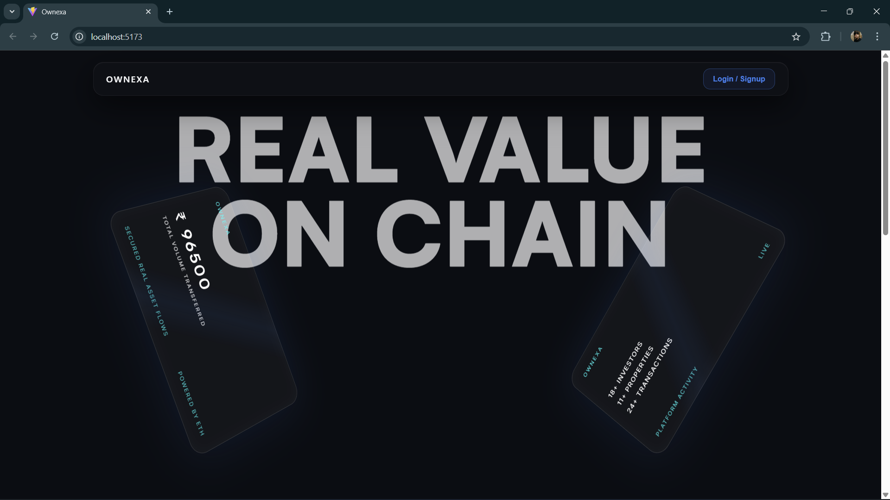 | 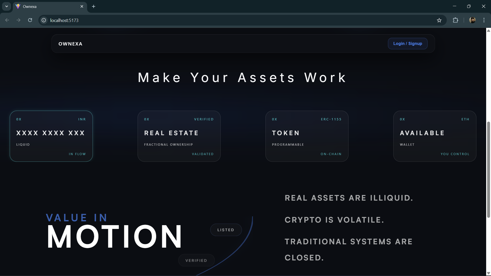 |
| 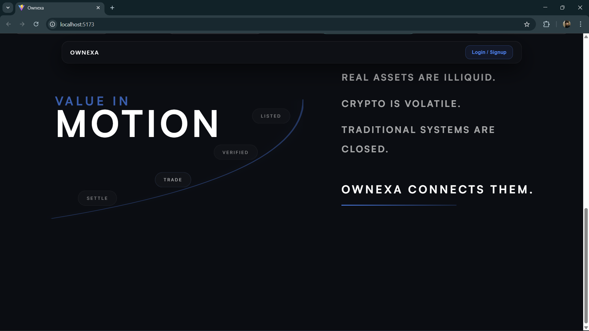 | 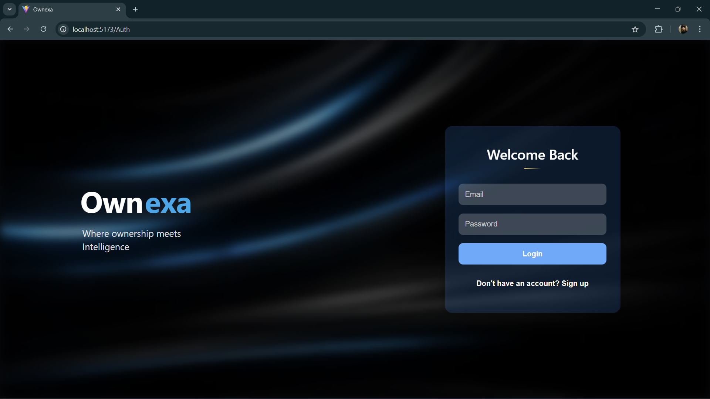 |

---

### 💼 User Profile & Transactions

| | |
|---|---|
| 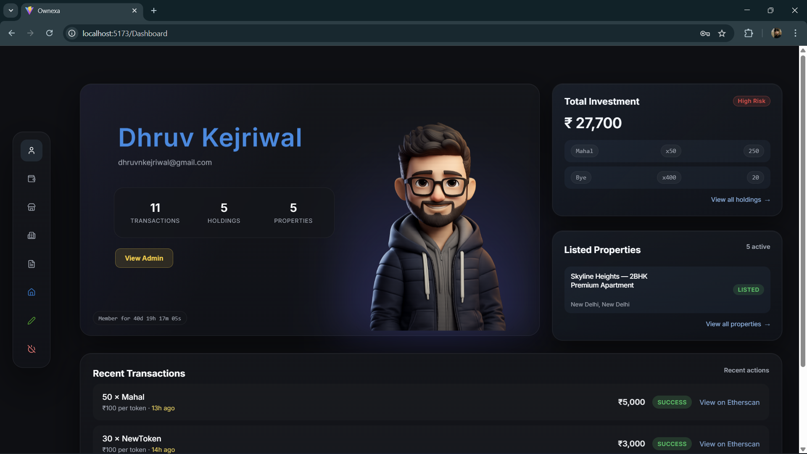 | 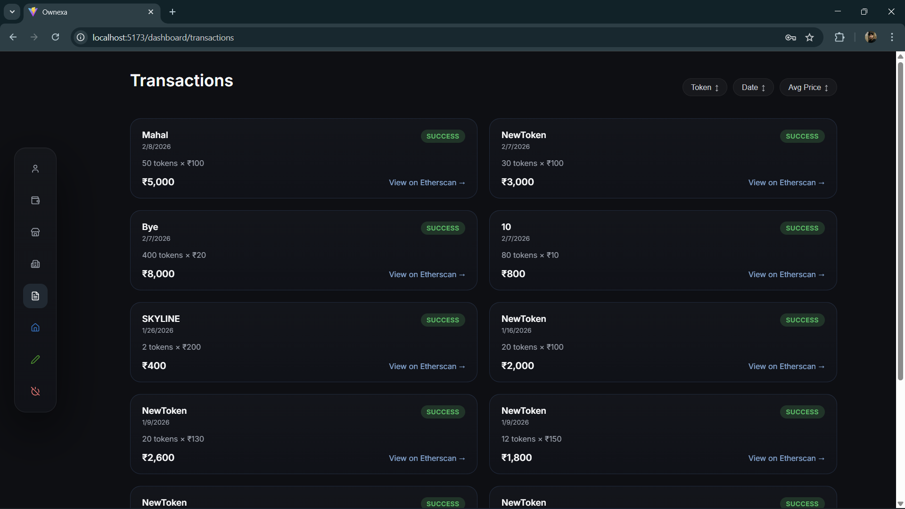 |
| 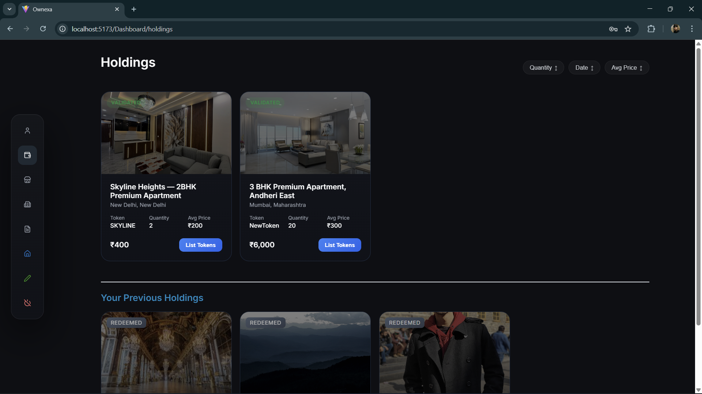 | 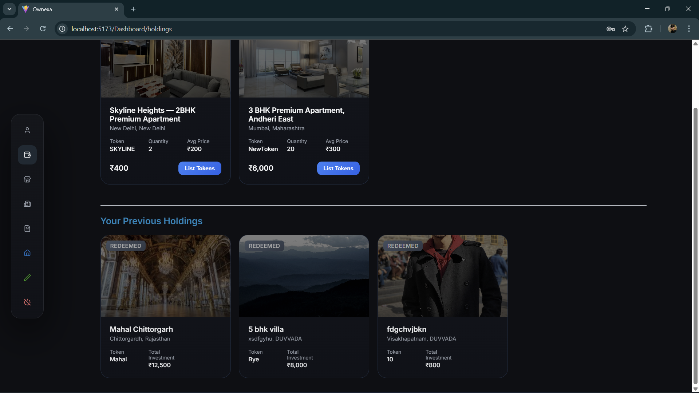 |

---

### 🛠 Admin Panel

| | |
|---|---|
| 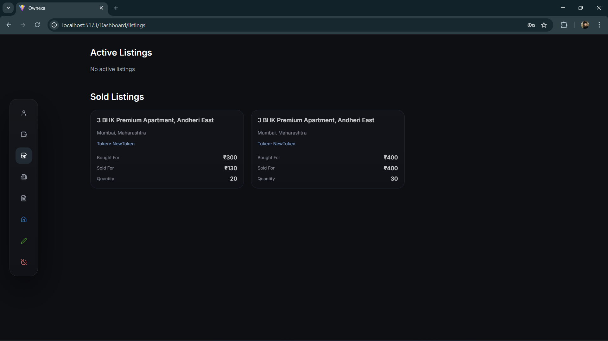 | 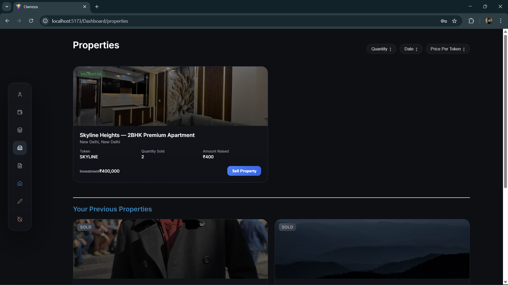 |
| 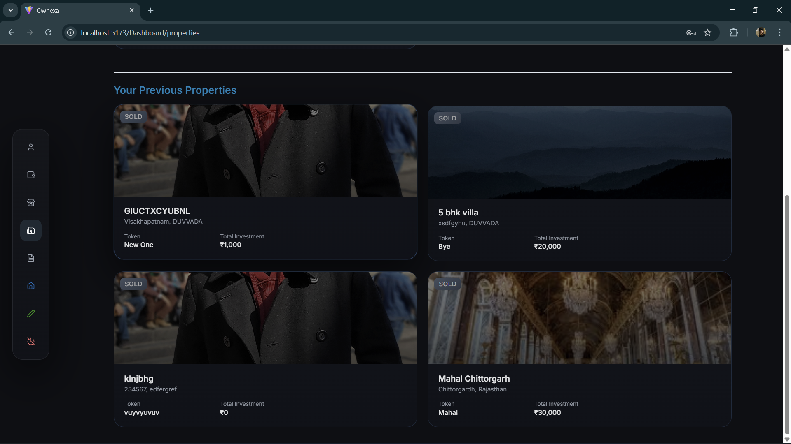 | 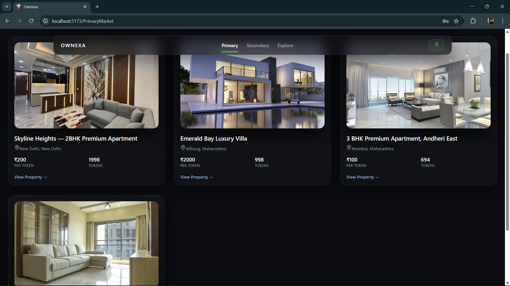 |

---

### 🔗 Blockchain & System

| | |
|---|---|
| 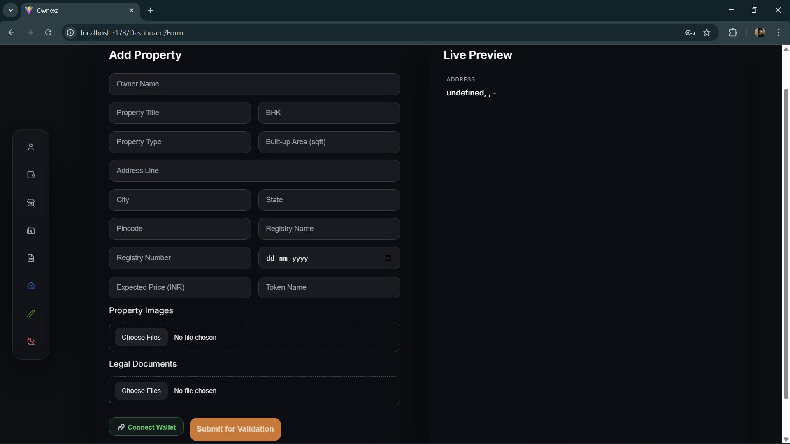 | 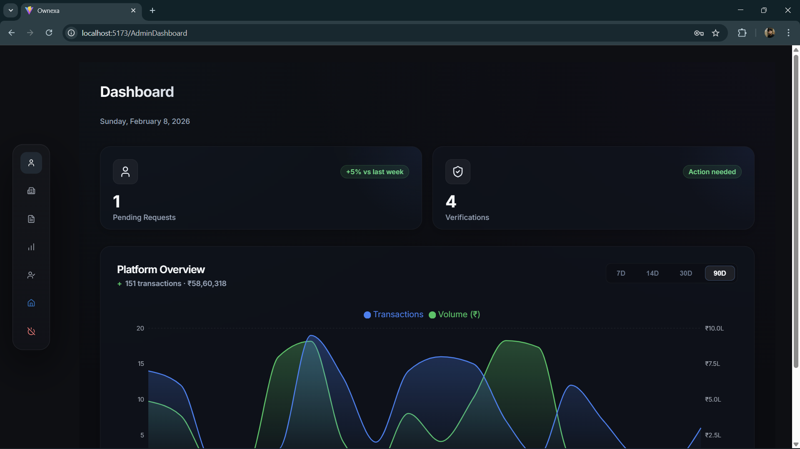 |
| 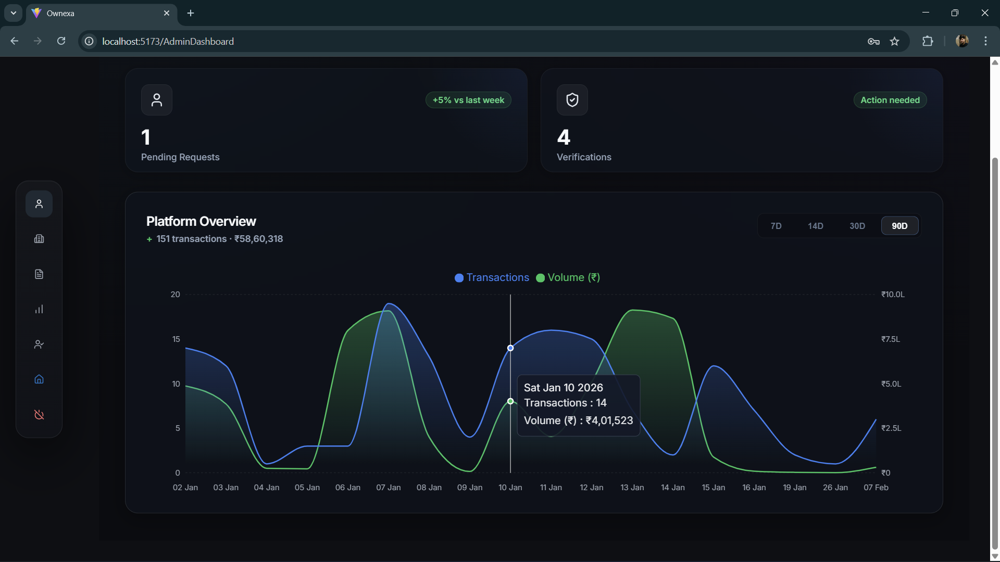 | 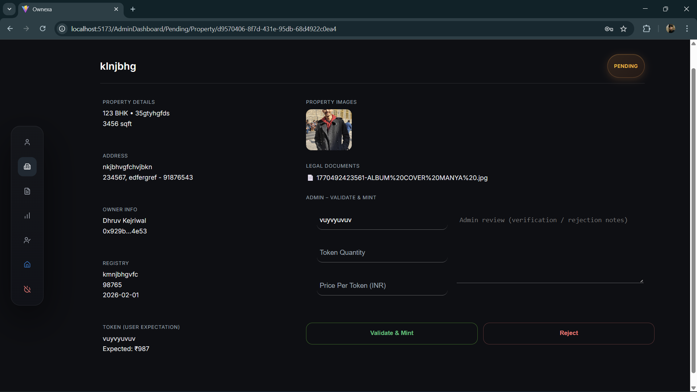 |
| 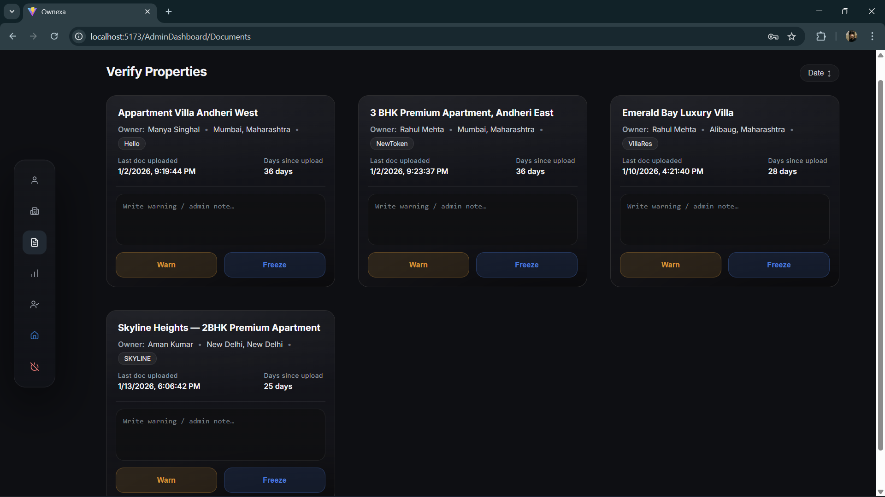 | 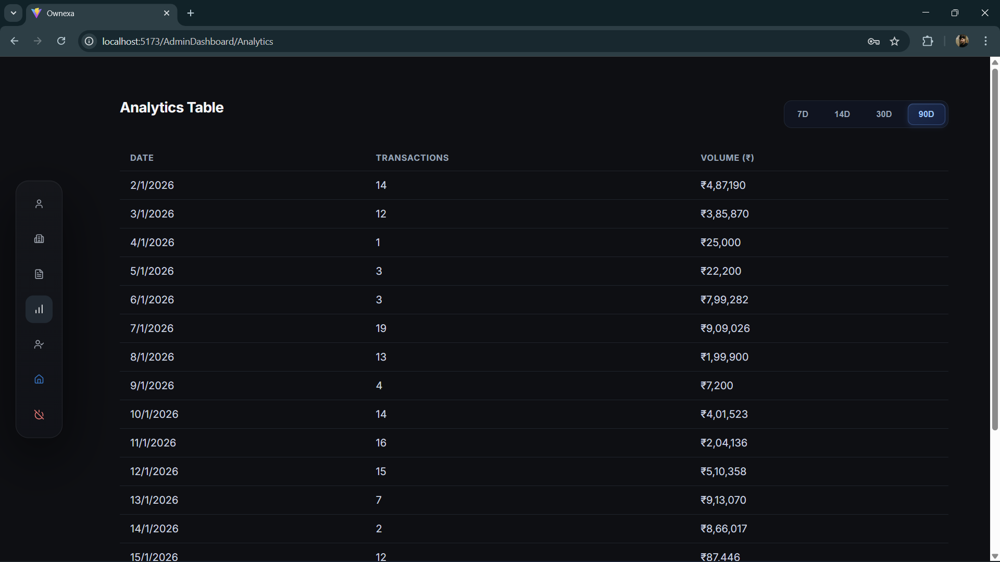 |

------------------------------------------------------------------------

## 🎯 Key Features

-   Fractional real estate ownership\
-   Primary & secondary token marketplace\
-   Admin validation system\
-   MetaMask wallet integration\
-   Settlement & redemption\
-   Future ML-based risk analysis

------------------------------------------------------------------------

## 🧱 Tech Stack

**Frontend:** React (Vite)\
**Backend:** Express + FastAPI\
**Database:** Supabase\
**Blockchain:** Solidity, Hardhat, Ethers.js\
**Network:** Sepolia Testnet

------------------------------------------------------------------------

## 📂 Folder Structure

    Ownexa/
    ├── assets/
    ├── Blockchain/
    ├── Backend/
    ├── Model/
    ├── Frontend/
    └── README.md

------------------------------------------------------------------------

## ⚙️ Setup

### Frontend

``` bash
cd Frontend
npm install
npm run dev
```

### Backend

``` bash
cd Backend
npm install
npm start
```

### ML API

``` bash
cd ML_API
python3 -m uvicorn ml_api:app --reload
```

### Blockchain

``` bash
cd Blockchain
npm install
npx hardhat compile
npx hardhat run scripts/deploy.js --network sepolia
```

------------------------------------------------------------------------

## 👨‍💻 Developer

**Dhruv Kejriwal**

Full Stack Blockchain Developer

------------------------------------------------------------------------

## 📄 License

MIT License
